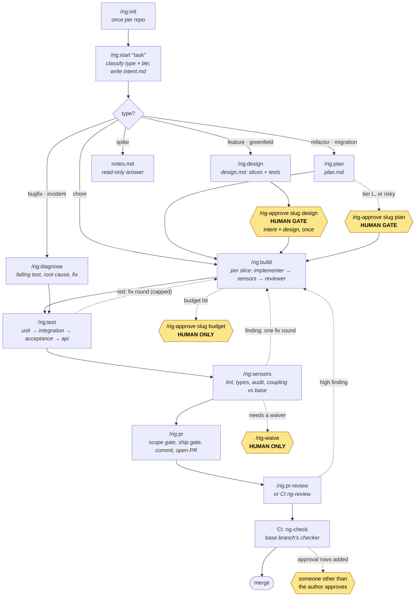

# rig: a thin AI-native SDLC harness for Claude Code

This plugin turns Claude Code into a disciplined software engineer. It adds very little of its own and relies on what Claude Code already provides. It follows [the AI-native SDLC playbook](https://claude.com/blog/the-ai-native-sdlc-playbook) and measures both the playbook's metrics and what each change costs.

It handles every kind of task: greenfield, brownfield, feature, bugfix, refactor, migration, chore, spike and incident. How much process a change goes through depends on its type and tier. See [DESIGN.md](DESIGN.md) for the evidence and the reasoning behind each choice.

## Status

As of 2026-10-06. `.claude-plugin/plugin.json` says **0.4.1**, the last release and tag; everything built since is on `main` and listed under *Unreleased* in [CHANGELOG.md](CHANGELOG.md). No later release has been cut.

| Area | State | Evidence |
|---|---|---|
| Lifecycle: start, design or plan, build, test, sensors, PR, review; human gates; tiers | Shipped and trialled live with paid runs | [DESIGN.md](DESIGN.md) §§8 and 9 |
| Autonomous ratchet (bounded build, quality and cost caps) | Shipped | DESIGN §9 |
| Git hooks: `pre-commit`, `pre-push`, session-start wiring, warnings the agent sees | Merged and covered by tests that drive real `git`. **Not yet trialled live.** There is no bypass guard: CI plus branch protection is the boundary | DESIGN §10, [SECURITY.md](SECURITY.md) |
| Windows | **Not supported.** Its CI jobs are red, and the hook scripts are POSIX `sh` | SECURITY.md |

**Quality gates on `main`:** the full suite (about 600 tests), `npm run typecheck` and `claude plugin validate` pass locally. In CI trust the Linux and macOS jobs and the dogfood check; the Windows jobs fail for the reason above. Open items are in [DESIGN.md](DESIGN.md) §§9-11.

## How the harness is put together

rig is a **thin control layer** around Claude Code. It owns five things (the artifact chain, human gates, guardrails, routing and budgets, measurement) and borrows everything else (plan mode, `/code-review`, `/security-review`, `/goal`, worktrees) from Claude Code itself.

### Core design principles

Thin layer with built-ins first; ceremony scales with risk; state lives in files; humans gate and models never self-approve; deterministic checks decide and models advise; local equals CI; the right model per job; bounded loops; every step ends with the next command. [DESIGN.md](DESIGN.md) §2 gives each one and its reason.

### The layers

```
 ┌────────────────────────────────────────────────────────────────────────┐
 │ YOU            /rig:start  /rig:next  /rig-approve  /rig-waive         │  intent, approval
 ├────────────────────────────────────────────────────────────────────────┤
 │ SKILLS (16)    start design plan diagnose build test sensors pr …      │  the stages: prompts
 ├────────────────────────────────────────────────────────────────────────┤
 │ AGENTS (5)     scout·haiku  researcher·haiku  architect·opus           │  model routing:
 │                implementer·sonnet  reviewer·opus (by role and tier)    │  small fresh contexts
 ├────────────────────────────────────────────────────────────────────────┤
 │ HOOKS          session-start · prompt-submit · post-edit · stop ·      │  guardrails: run in
 │                skill-failed                                            │  -p and CI, zero tokens
 │                + git: pre-commit · pre-push (any editor or agent)      │
 ├────────────────────────────────────────────────────────────────────────┤
 │ SCRIPTS        sdlc.ts → check · sensors · graph · ratchet · runs …    │  the deterministic brain
 ├────────────────────────────────────────────────────────────────────────┤
 │ MOD (optional) band · /rig-status · /rig-story · /rig-run · cost       │  UI and telemetry only;
 │                capture                                                 │  nothing essential here
 ├────────────────────────────────────────────────────────────────────────┤
 │ EVIDENCE       .sdlc/changes/<slug>/  intent design plan runs.jsonl    │  committed; read by
 │                verification approvals waivers pr.md ship.json          │  CI (`rig-check`)
 └────────────────────────────────────────────────────────────────────────┘
```

Dependencies point downward and evidence flows upward. Skills never decide anything the scripts can compute, and nothing essential depends on the optional mod. The scripts are plain Node with no build step and no dependencies.

### Command graph: the lifecycle of one change

Squares are commands, hexagons are **human gates**, and the dotted edge is the repair loop. Run `/rig:next` at any node and it picks the right edge.



Which gates a change actually meets comes from `gates` in `.sdlc/sensors.json` (default: tier S none, M design, L and greenfield spec, plan and design) and only where that stage is on the change's path. In practice a feature meets one design gate at M and L, and a refactor or bugfix meets a plan gate at L. A change whose recorded tier or type is edited later falls back to the stricter reading until a person runs `/rig-approve <slug> tier`.

### Routes: one metro map

Each line is a change type. `●` is a node, `◆` is a gate that applies at tier L (design also at tier M for features).

```
feature     ●start ─ ●design ─◆─ ●build ─ ●test ─ ●sensors ─ ●pr ─ ●pr-review
greenfield  ●start ─ ●design ─◆─ ●build ─ ●test ─ ●sensors ─ ●pr ─ ●pr-review
refactor    ●start ─ ●plan ───◆─ ●build ─ ●test ─ ●sensors ─ ●pr ─ ●pr-review
migration   ●start ─ ●plan ───◆─ ●build ─ ●test ─ ●sensors ─ ●pr ─ ●pr-review
bugfix      ●start ─ (●plan ◆ at L) ─ ●diagnose ─ ●test ─ ●sensors ─ ●pr ─ ●pr-review
incident    ●start ─ (●plan ◆ at L) ─ ●diagnose ─ ●test ─ ●sensors ─ ●pr ─ ●pr-review
chore       ●start ─────────────────── ●build ─ ●test ─ ●sensors ─ ●pr ─ ●pr-review
spike       ●start ─ ●notes                                      (no code, no gates)
```

For tier S and M the `pr-review` stop is dropped when the `rig-review` workflow is installed, because CI performs it. `/rig:incident` joins the map from the side: it records what broke and opens an `incident` change on the bugfix line.

### Command atlas: when to reach for each

**Drive the change** (the model runs these; `/rig:next` chains them)

| Command | Use it when | Cost |
|---|---|---|
| `/rig:init` | First time in a repo. Writes CLAUDE.md, `.sdlc/`, and vendors the harness. | tokens, once |
| `/rig:intent "<idea>"` | Anyone with an idea, in Claude Code or on claude.ai. Asks for the author and writes a draft `.sdlc/intent/<name>.md` for a product owner to accept (without a file system it shows the file to commit). | tokens |
| `/rig:start "<task>"` | Any new task, or to resume one by slug, or an inbox file (`.sdlc/intent/<name>.md`); `--plan-only` stops before any build. Classifies type and tier, writes `intent.md`; tier S is built in the same turn. | tokens |
| `/rig:next` | You are not sure what is next. Runs the next node, stops at a human gate. | tokens |
| `/rig:design` · `/rig:plan` · `/rig:spec` | Writing the design (feature, greenfield), plan (refactor, migration, L bugfix) or spec. | Opus architect at tier L |
| `/rig:diagnose` | Bugfix or incident: reproduce with a failing test, then the smallest fix. | tokens |
| `/rig:build` | Approved design or plan: slice by slice, bounded review loop. | Sonnet; tier L slice review Sonnet high |
| `/rig:test` · `/rig:sensors` | After build: run every test level, then the quality sensors against base. | mostly zero-token |
| `/rig:pr` · `/rig:pr-review` | Ship: commit, push, open the PR, then review it, fix once and sweep review comments and failing checks to green (at most 3 rounds per run; pending checks end the run, rerun it later). | tokens |
| `/rig:incident "<what broke>"` | Production is on fire. Records it and opens a bugfix-path change. | tokens |

**Look, at zero tokens** (mod; no model call)

| Command | Shows |
|---|---|
| `/rig-status` | Where every change stands and the next command. |
| `/rig-map` | Mission control: the SDLC as a subway map with where you are, the fix loop, spend per station, and token and dollar gauges. |
| `/rig-story` | The active change's nodes, rounds and cost against budget. |
| `/rig-sensors` | Findings, known-red items and waivers. |
| `/rig-metrics-pane` | The scorecard: cost, tokens and value per change and node. |
| `/rig-run` | Drives the change one node per turn; stops at a gate, a block, or no progress (`/rig-run stop` pauses). |

**Decide, human only** (the model cannot invoke these and cannot set `SDLC_HUMAN`)

| Command | Authorises |
|---|---|
| `/rig-approve <slug> design\|spec\|plan` | The artifact as written. Stale if it changes afterwards. |
| `/rig-approve <slug> impact` | A cross-repo impact set. |
| `/rig-approve <slug> budget` | A higher spend cap. |
| `/rig-approve <slug> full-route` | Full routing for one change: turns budget downshift off for it. |
| `/rig-approve <slug> tier S\|M\|L [type]` | A tier or type edit. The recorded tier is a floor, so only a person lowers it. |
| `/rig-waive <sensor> <file\|*> <reason>` | One sensor finding on the active change. |

**Improve the harness itself**

| Command | Use it when |
|---|---|
| `/rig:rule "<what recurs>"` | The agent made the same mistake twice: promote it to a mechanical rule, or, when no pattern can catch it, to one line of CLAUDE.md's `## Things Claude gets wrong`, which you add. `/rig:pr-review` suggests it when a finding's category repeats. |
| `/rig:metrics [days]` | You want the 12 playbook metrics plus cost per change, stage and agent. |
| `node .sdlc/bin/sdlc.ts evals` | Before merging a change to CLAUDE.md, a skill, a hook, the guides or rules: runs `.sdlc/evals/*.json` with `claude -p` in a throwaway worktree and prints a pass rate against `evals.minPass` (advisory). `--seed` drafts evals from shipped changes; `--only <id>` runs one. Eval definitions are protected files: run it in the sandbox. |

**Eval files.** Each `.sdlc/evals/<id>.json` holds:

| Field | Meaning |
|---|---|
| `prompt` | The task `claude -p` gets. |
| `checks` | At least one of `{"kind": "command", "cmd"}` (exit 0 passes), `{"kind": "file-contains", "path", "text"}`, `{"kind": "file-absent", "path"}`, `{"kind": "skill-loaded", "name"}`. |
| `allowedTools` (optional) | Passed to `--allowedTools`: under `-p` nothing prompts, so list the edit and Bash tools the task needs. |
| `base`, `files`, `source` (optional) | The commit the code comes from (default HEAD); files taken from HEAD on top of it, such as the regression test; where the eval came from (`change:<slug>`, `incident:<file>`). |

Results append to `.sdlc/evals/results.jsonl`, which you commit: it is the evidence a person attaches to the PR (two branches that both ran evals merge it by keeping both sides). A result also depends on the runner's user-level Claude Code settings, not only on the repository.

**The script underneath** (`node .sdlc/bin/sdlc.ts <cmd>`): `status`, `next`, `inbox`, `watch`, `check`, `check-file`, `diff`, `quality`, `ratchet`, `run`, `verify`, `verify-report`, `pr`, `pr-checks`, `scope-drift`, `secrets`, `preflight`, `points`, `shards`, `waive`, `approve`, `impact-status`, `metrics`, `scorecard`, `vendor`, `hooks`, `hook <event>`, `evals`. Skills and CI call these; so can you.

### Intent inbox and policy skills

`.sdlc/intent/<name>.md` holds ideas before a change exists. A person writes `status: draft | accepted | closed`; `shipped` is derived from the change whose intent.md names the file as `source:`. `sdlc.ts inbox [--pending] [--json]` lists them, and `status` names accepted ones with no change (also before any change exists). Accepting is a merge, so put `/.sdlc/intent/` in CODEOWNERS and the inbox's owners decide. The `intent` skill can also be uploaded to claude.ai for people who don't use Claude Code.

`templates/rig-spec.yml` drafts each accepted intent after it merges to the trunk. A read-only model job runs `/rig-start … --plan-only` (`--plan-only` stops `start` and `design` before asking for approval and before any build; resuming under it reports status and stops). A model-free job accepts only rig's own files in one change folder, refuses a change the trunk already has, and publishes only the Markdown a person reviews (`intent.md`, `design.md`, `spec.md`, `plan.md`, `notes.md`) as a PR on `sdlc/intent-<name>`. rig's records (ratchet.json, impact.json and the rest) are not published, so the change waits for `/rig-approve <slug> tier <S|M|L> <type>` before any other step, and resuming it re-runs `check --at plan` to re-derive impact. A PR opened with `github.token` triggers no `pull_request` workflows, so a required `rig-check` waits: push a commit to the PR branch, close and reopen the PR, or give `gh pr create` a GitHub App or fine-grained token so checks run. If a run pushed the branch but failed before the PR opened, the intent is no longer pending: delete `sdlc/intent-<name>` to redraft it. One secret is needed: `CLAUDE_CODE_OAUTH_TOKEN` or `ANTHROPIC_API_KEY`.

Policy skills live at `.claude/skills/policy-<area>/SKILL.md` with an `owner` and a `source`; `init --full` scaffolds `policy-security`. Design, plan and spec apply each one and record a conflict as `- [policy-<area>] <concern> → owner: <owner>` under `## Concerns`. Any `## Concerns…` or `### Concerns…` heading counts. Approval is refused until each concern ends ` → resolved: <decision> (<owner>)` (on an indented line below it also counts); a document without the section approves as before.

### Parallel work

Running one change's slices in parallel sessions is not supported yet: the slices share one `ratchet.json`, and the slice checkpoint commits only on `sdlc/<slug>`. Separate changes can run side by side, each in its own checkout on its own `sdlc/<slug>` branch.

### What fires when (the automatic edges)

| Moment | Hook | What happens, at zero tokens |
|---|---|---|
| Session opens | `session-start` | Injects the active change, its next command and the guides that apply. |
| You submit a prompt | `prompt-submit` | Snapshots the tree as the turn baseline, so Stop judges exactly this turn's diff. |
| After an edit | `post-edit` | Rejects secrets and plans containing code, runs the file's sensors against the turn baseline, and injects a matching guide once per session. |
| A subagent starts or stops | `subagent-start`, `subagent-stop` (async) | Append lane events (agent, duration) that the scorecard turns into work, span and idle time. Observational: they never block. |
| A turn ends | `stop` | Runs the sensors on the turn's diff; blocks at most 2 times, then records `unresolved.json`. |
| A skill fails to load | `skill-failed` | Hands the model the exact fallback command for that stage. |
| You commit | git pre-commit | The staged diff goes through the Stop sensors and the fast commands; warnings print with their fix text, blocks refuse the commit (during a merge or rebase only the fast commands are skipped). |
| You push | git pre-push | The branch's commits (against its merge-base with the trunk, as CI) go through the ship checks and the quality ratchet; warnings print with their fix text; `githooks.prePush: "off"` disables it. |
| A PR opens | CI `rig-check`, `rig-review` | The base branch's checker re-judges; the reviewer (S Sonnet medium, M Sonnet high, L Opus high) reads a prepared diff; human-approval check on approval rows. |

**Safety.** No hook runs on Bash. Evidence is protected by `permissions` deny rules and by CI, which recomputes every verdict from the base branch's checker. A shell script can still write a file locally; CI plus branch protection is the boundary.

## Install

The harness lives in each repo it runs on, so a repo never depends on the plugin. You need the plugin only to initialise a repo and to upgrade it.

**Requirements:** Node 22.18 or later (the scripts run as plain TypeScript with no build step), `git`, a POSIX shell (the git hooks are `sh`) and Claude Code 2.1.251 or later (model by tier depends on it: before that release `CLAUDE_CODE_SUBAGENT_MODEL` overrode the per-call `model`, so every subagent would run on Haiku 5.5). Per-launch model aliases (`haiku`, `sonnet`, `opus`) resolve through `ANTHROPIC_DEFAULT_*_MODEL` in `templates/settings.json`; without them `haiku` can resolve to an older Haiku. macOS and Linux are supported; Windows is not (see Status). The GitHub CLI `gh` is used by `/rig:pr`, the PR metrics and the CI approval check, and is optional otherwise.

1. Install the plugin for yourself (once per machine):

   ```bash
   claude plugin marketplace add cwijayasundara/claude_code_harness_lite_v2
   claude plugin install rig@rig
   ```

   Or, for one session: `claude --plugin-dir /abs/path/to/claude_code_harness_lite_v2`.
2. In the repo, make a first commit if it has none, then run `/rig:init`. It writes a compact CLAUDE.md, `.sdlc/` (sensors, guides, the checker CI runs) and copies the harness into the repo (`vendor --standalone`): skills to `.claude/skills/rig-*`, agents to `.claude/agents/rig-*`, hooks to `.claude/settings.json`, scripts to `.sdlc/bin`. It offers the CI check, the PR review workflow and [`templates/settings.json`](templates/settings.json) (Sonnet main thread, advisor off, Haiku 5.5 general subagents).
   Run `node .sdlc/bin/sdlc.ts hooks install` (or let the first Claude Code session do it) to wire the git hooks; they cover editors and other agents. `--no-verify` still works for a person; CI is the floor. To opt out, run `node .sdlc/bin/sdlc.ts hooks uninstall`: it sets `rig.githooks = off`, so session start no longer wires them, until `hooks install`.
3. Commit `.sdlc/`, `.claude/` and `CLAUDE.md`. Anyone who clones the repo, and any cloud session, now runs the harness with no install. In the repo the commands are `/rig-start`, `/rig-next` and so on.

**Where things live.** Change artifacts, approvals, waivers and run records go in `.sdlc/`, not `.claude/`, for two reasons. Claude Code treats `.claude/` as protected, so writes there prompt and fail in headless runs. And these files are evidence the `rig-check` CI gate reads, so they are meant to be committed. Machine-local state (`.gate`, `.baseline`, `usage.jsonl`, `unresolved.json`) is already in `.sdlc/.gitignore`.

**Upgrade** by re-running `node <plugin>/scripts/sdlc.ts vendor --standalone` from a newer plugin and committing; `.sdlc/bin/VERSION` records the version in the repo. To keep a repo on the plugin instead (central upgrades, no copy), tell onboarding the team installs the plugin.

**With and without the plugin.** A standalone repo has everything that decides what may happen: skills, agents, hooks, sensors, gates and the CI check. `/rig-approve` and `/rig-waive` are skills only the person can invoke: the model cannot call them, and it cannot set `SDLC_HUMAN` itself. Installing the plugin as well adds the mod: the band, the `/rig-sensors` pane, the impact dialog, `/rig-status` with no model call, and per-stage cost capture for `/rig:metrics`. The plugin's own hooks step aside in a standalone repo, so none runs twice. The mod needs Claude Code 2.1.287 or later.

## Team install

1. Onboard as above and commit; teammates need nothing else. To upgrade a repo, run `claude plugin marketplace update rig`, re-run `vendor --standalone` and commit. Releases are tagged (`v0.3.7`), and CHANGELOG.md records what each one changed.
2. Builds use sdlc's own implementers. To run a tier L or greenfield build through superpowers subagent-driven development (6.4.1 or later), enable superpowers and set `"build": "sdd"` in `.sdlc/sensors.json`. It costs several times the tokens, so keep it for plans with many independent slices.
3. For the PR review, add a `CLAUDE_CODE_OAUTH_TOKEN` repository secret (your Pro/Max plan, from `claude setup-token`) or an `ANTHROPIC_API_KEY`, copy `templates/rig-review.yml`, and make `rig-check` and `rig-review` required checks with both workflows in CODEOWNERS.

4. Read [SECURITY.md](SECURITY.md) before rollout. The hooks are guardrails; the boundary is CI plus branch protection, code-owner review and managed settings. A PR that adds approval or waiver rows fails `rig-check` until someone other than its author approves the head commit.

**Opus advisor: off.** In the v0.3 trials an Opus advisor on the main thread was the largest single cost, about a third of each run. A user-level `advisorModel` still applies to every project, so the template turns the advisor off with `"env": { "CLAUDE_CODE_DISABLE_ADVISOR_TOOL": "true" }`. Remove that line to opt back in. Opus still writes tier L specs and plans (architect) and reviews.

**Gates by risk, not size.** Tier S has no human gate, and tier M has one (the design, approved once with the intent). Their build still reviews each slice in session (a bounded loop), then they walk test, sensors, pr and, when the PR review workflow is not installed, pr-review. Where the workflow is installed, the review of the PR runs there from `templates/rig-review.yml` (S Sonnet medium, M Sonnet high, L Opus high, with no shell or network, reading a prepared diff; a model-free step posts the comment after a credential check; fails only on a high-severity finding; needs a `CLAUDE_CODE_OAUTH_TOKEN` secret from `claude setup-token` for a Pro/Max plan, or an `ANTHROPIC_API_KEY`). Tier L, and anything touching auth, payments, data, security or a public contract, keeps the spec and plan gates and an in-session `/code-review` plus the plan-contract check. A diff over `limits.diffLines` blocks at ship unless the person approved its plan.

## Cloud sessions

Long builds belong in a Claude Code cloud session (claude.ai/code or `claude --cloud`). It keeps running while your laptop sleeps. In the Prism build, the laptop sleeping accounted for most of the 3 days. A standalone repo runs there as it is: `claude --cloud "/rig-next — continue through ship; commit on the branch"`. The result comes back as a pushed branch or PR, and `--teleport` brings the session back to your machine. Tier S changes have no gates, so they can run in the cloud from start to finish; tier M needs the one design approval first. For tier L, approve the spec and plan locally and push before the cloud build: `/rig-approve` has not been tried in a cloud session.

## Guides and sensors

Computational sensors run on the hot path at zero tokens; one inferential review runs per change. `sdlc.ts check` is the single entry point, so local equals CI.
- **Config** is `.sdlc/sensors.json`: `fast`/`full` commands, `tests`, `testSupport` (overlaid with the tests when proving against the base), `fixtures` (exempt from pattern sensors only; deletions stay tracked and adding a glob counts as weakening), `ignore`, `contracts`, `consumers`, `layers`, `limits`, `knownRed`, `githooks` (`{ prePush: "ship" | "off", budgetMs }`), and, new in 0.6: `scopes` (glob to `{ name, root, fast, full, quality, deps }`), `scopeLimit` (default 3), `ci.scope` (`affected` | `all`), `affected` (optional command naming extra scopes; fails closed), `sparseBase` (opt-in; relies on complete `deps`, see DESIGN §6), `points` (`{ S, M, L }`, default 5, 7, 11) and `idleGapMs`. `.sdlc/rules.json` holds regex rules.
- **Scopes (monorepos).** With `scopes` declared, a diff runs only the `fast`, `full` and `quality` commands of the scopes it touches and their `deps` dependents, each in its scope root; files outside every scope run the top-level commands and warn `unscoped`. A diff spanning more than `scopeLimit` scopes is re-tiered to L, and shards group by scope. CI selects from the diff and the base branch's config (`ci.scope: "all"` runs everything). Roots must be relative and inside the repo. If the optional `affected` command fails, every scope counts as affected. `sparseBase: true` measures the base in a throwaway sparse worktree (cone checkout of the affected scopes and their `deps` closure; your `.git/config` is never touched; any failure falls back to a full checkout). It is opt-in and relies on correct `deps`: a scope tool that reads outside its declared closure can fail or over-count on the sparse base and hide a regression, so declare `deps` completely or leave it off.
- **Preflight.** `/rig:init` runs `sdlc.ts preflight` and writes `.sdlc/PREFLIGHT.md`: stack, toolchain, commands, base, remote, consumers and protection. It is advisory (nothing trusts its `result:` line; `status` only compares its age) and it checks the repo root only, not each scope's toolchain. A repo set up before 0.6.0 fails the protection check until you rerun `init --full`. The file records host versions, so you may want to gitignore it.
- **Sensors:** test-tamper, suppression, layering, size, secrets, rules, contract-impact, harness-tamper, traceability and red-proof, plus ad-hoc, commands and config findings.
- **When they fire:** on each edit (secrets, tamper and guide context, from the post-edit hook), at Stop (the turn's diff), at plan and ship (traceability, red-proof, impact), and in CI.
- **Red-proof** depends on the change type: changed tests must fail on the base for bugfix and incident, and for feature and greenfield at M and L; they must pass on the base for refactor at M and L; chore and migration are exempt.
- **Stop cap:** a turn is blocked at most 2 times, then the findings go to `.sdlc/unresolved.json` and ship and CI refuse them, so a loop cannot wedge a session. Findings that are red on the base are ratcheted as known-red rather than blamed on the change.
- **Waivers** come only from the person (`/rig-waive`). Evidence files (approvals, waivers, `runs.jsonl`, `verification.md`, `impact.json`, `ratchet.json`, `events.jsonl`, `pr.md`, `ship.json`, `.gate`) are written only by sdlc.
- **Guides** (contracts, engineering, testing) are copied to `.sdlc/guides/` by init and injected on first touch of a matching path.
- **CI:** `sdlc.ts vendor` copies the checker into `.sdlc/bin`; copy `templates/rig-check.yml` and require `rig-check`. CI runs the base branch's checker and config.

**Autonomous build to PR.** A feature or greenfield change goes intent → design: `/rig:start` writes `intent.md`, `design.md` follows in the same turn, and the person is asked **once** (the mod shows an Approve dialog; `/rig-approve <slug> design` without the mod) for both files together. Once the design is approved, build runs slice by slice with a bounded review loop per slice, then test levels, quality sensors compared with the base branch, and the PR with its checks; in a standalone repo `init --full` allows the project's own `node --disable-warning=ExperimentalWarning .sdlc/bin/sdlc.ts …` calls, so the implementer and reviewer subagents (which skill `allowed-tools` do not cover) run the recorder without a prompt; with the plugin alone, declared commands prompt unless Claude Code runs in auto mode or you add your own `permissions.allow` rules. Humans keep approvals, waivers and budget raises. `sensors.json` keys: `gates` (human gates per tier), `levels` (test commands per level), `quality` (lint-style commands compared with base), `ratchet` (round and budget caps) and `value` (`{ rate, hours }`: an hourly rate and hours saved per tier S, M and L, so value is an estimate). Run autonomous builds in Claude Code's sandbox.

For long unattended builds, `/rig:build` prints a ready `/goal` line, so you don't have to keep typing "continue".

## What is in the box

| Part | Role |
|---|---|
| `skills/` (16) | The stages, run by the main thread (Sonnet 5.5; the Opus advisor is opt-in, see below). No skill sets `model:`, because a model switch re-reads the whole conversation uncached. The role and the tier pick each subagent's model and effort (`scripts/routing.ts`; `next --json` carries `routes`) and each agent's own `model:` is the default when no route applies; they start with their own small contexts. |
| `agents/scout.md` | Haiku 5.5, read-only, `omitClaudeMd`. Cheap code search, used instead of Explore running on your main model. |
| `agents/architect.md` | **Opus 5.5**, high effort. Writes spec.md, plan.md and design.md, the design-heavy steps. |
| `agents/implementer.md` | **Sonnet 5.5**. The code generator: builds one slice test-first and reports real test output. |
| `agents/reviewer.md` | **Opus 5.5**, high effort. One independent review per change, keeping findings at confidence 80 or above. |
| `hooks/hooks.json` | Five blocking or injecting settings hooks plus two async lane hooks (`subagent-start`, `subagent-stop`), none on Bash, which also hold in `-p`. `session-start` injects session context; `prompt-submit` records the turn baseline; `post-edit` rejects secrets and plans that contain code and runs the file's sensors against that baseline (exit 2), injecting a matching guide once per session; `stop` runs the quality gate on the turn's diff (the sensors on the diff, the `fast` commands keyed by a stamp of the whole tree, so a tree that already passed them skips them); `skill-failed` hands over the skill-load fallback. |
| `hooks/register.ts` | The mod. It records per-turn tokens and the dollar delta from the session ledger, shows the context and spend band, runs the zero-token commands and the context-budget nudges. It marks the session's first main turn, so the context sensor (`scripts/context.ts`) can warn when a session starts over 25k tokens, naming the enabled plugins, and when a turn passes 150k. |
| `scripts/*.ts` (32, not counting specs and testkit) | Zero-dependency Node, no build step (the list names the main ones; the rest are `graph`, `ratchet`, `levels`, `quality`, `pr`, `scorecard`, `vendor`, `basetree`, `flow`, `githooks`, `shards`, `slicecheck`, `stamp`, `verify`, `configparse`, `points`, `timing`, `slices`, `stale`, `checkpoint`, `scopes`, `toolchain` and `preflight`): `core` (paths, change state, approvals), `model` (pure diff, config and glob model), `sensors` (the pure sensors), `diffs` (baselines and git diffs), `runs` (captured exit codes and verification reports), `check` (one `check` entry point for Stop, plan, ship and CI), `hooks` (hook decisions and the Stop gate), `metrics` (playbook metrics and cost), `sdlc` (the CLI). |
| `guides/` | Short per-area guides (contracts, engineering, testing) injected when a matching file is touched. |
| `templates/rig-check.yml` | The required CI check, judged by the base branch's vendored checker. |
| `templates/rig-review.yml` | One background Claude review per PR, for tier S and M and as a second look on L. |
| `templates/managed-settings.json`, `templates/production-gate.sh` | For the platform team's managed settings: the playbook's p.42 example plus rig's own rules, and the p.41 production gate as a managed-only hook (see SECURITY.md). `/rig:metrics` reports `gate_wait_hours`, `gate_violations_escaped` and `managed_controls_in_force`. |
| `templates/rig-triage.yml` | When a CI workflow fails, Haiku 5.5 reads the failed log and posts three lines (flaky or real, the evidence, the next step) to the PR. Name your CI workflows under `workflows:`. `/rig:metrics` reports `failures_triaged_without_paging`. |
| `templates/rig-rehearse.yml` | Runs your staging rollback weekly and on demand: set the repository variable `RIG_ROLLBACK_COMMAND` and a `staging` environment. `/rig:metrics` reports `rollback_rehearsal_success` and DORA (`deployment_frequency_per_week`, `lead_time_hours`, `change_failure_rate` from GitHub deployments to `RIG_PRODUCTION_ENV`, and `time_to_restore_hours` from incidents' `restored`). |
| `templates/rig-watch.yml` | Closes the loop hourly: `sdlc.ts watch` checks each of the `bands` you declare in `.sdlc/sensors.json` (a query that prints a number, or a JSON list with `count`; a metric whose history never varies needs `minSd`, its σ floor, or it stops at tier 2) against Western Electric rules, with no model. At tier 2 or 3, Haiku 5.5 diagnoses read-only and a pull request adds a draft `.sdlc/intent/breach-<band>-<date>.md` for a person to accept or close (closing widens the band). At tier 3 a band with the `runbook:rollback` route also starts `RIG_ROLLBACK_COMMAND` in the `production` environment, only after a green rehearsal and the environment's reviewers. `/rig:metrics` reports `findings_merged_share` and `dismissal_rate`. |

**Claude Tag on call.** When Claude Tag handles an incident in Slack, the on-call engineer runs `/rig:incident "<summary>" --escaped` and pastes the thread link as evidence: the incident file is the lessons file the playbook describes, and it feeds the same bugfix path and metrics as a breach from `rig-watch`.

The role and the change's tier pick the model and effort for every launch (`routes` in `sdlc.ts next --json`; the legacy `model` stays one release): scout, researcher and triage Haiku low, implementer Haiku (S) to Sonnet (M, L), reviewers Sonnet (S, M) to Opus (L), architect Opus at tier L. Repos override with `routing` in `.sdlc/sensors.json`, clamped to per-role floors. The settings template pins the haiku, sonnet and opus aliases to those IDs, and sets `ENABLE_STOP_REVIEW=0`: the security-guidance plugin otherwise runs an agentic Opus review of the whole diff on every Stop and SubagentStop, on top of rig's reviewer. One review per change, at the PR node (`/rig:pr-review` or `/security-review`), is the rule; the plugin's commit and push reviews stay.

`/rig:metrics` also reports what no usage row of ours sees: `background` counts the model sessions hooks or plugins spawned in this project (`sdk-py` and the like, from `~/.claude/projects`), per entrypoint and per change, and `cost.first_call_context` and `heavy_session_starts` show how much of each session was system prompt before any work.

### Budgets

Spend is shown always; budgets add levels and a light downshift. Budgets never pause or block work.

- **Config:** an optional `budget` block in `.sdlc/sensors.json`; every field is optional.
  ```json
  "budget": { "teamMonthlyUsd": 500, "changeUsd": { "S": 5, "M": 20, "L": 60 }, "warnAt": [50, 80, 100], "downshift": true }
  ```
  Raising or removing a budget, raising `warnAt` or setting `downshift: false` is a reviewed harness edit.
- **`sdlc.ts spend status [--json] [--change <slug>] [--no-fetch]`:** team spend this month, the projected month total, the budget and the percentage, plus the change's own spend. It lists the sources counted (each clone's id and `through` time) so a clone that never publishes shows up as missing. It prints `this clone only` when no remote copy exists, and the age of the cached copy when the fetch fails. Team totals come from `refs/rig/spend` (one `<YYYY-MM>/<id>.json` file per clone per month, plus `ci`; main-loop rows only), published after a passing pre-push check and after `sdlc.ts pr`; `spend publish` and `spend notify` run by hand.
- **Privacy:** every repo with rig's git hooks pushes `refs/rig/spend` on each push whether or not a budget is set, and its per-change dollar figures are readable by anyone who can read the remote; weigh that for public repos.
- **Setup caveat, pending a person's check on a scratch repo:** that GitHub accepts pushes to `refs/rig/spend` (the fallback is a branch named `rig-spend`).
- **Levels:** notice at 50%, tight at 80%, over at 100% of the monthly or the change budget; a projection that will cross 50% raises notice only. The band shows the level, a toast fires once per level per month, the mission pane has a budget line, the PR scorecard has a "Change budget" row and `metrics` has a `budget` block.
- **Downshift (tight or over):** reviewer, referee and slice-review effort drops one step (models and role floors unchanged), and an Opus main loop moves to the pinned `claude-sonnet-5-5` once per session, at a turn's first step. With the default settings (Sonnet main thread) expect modest savings; the main value is visibility.
- **Opt-outs:** `budget.downshift: false` (a reviewed edit, for everyone) or `/rig-approve <slug> full-route` (one change, human only). Warnings still show.
- **Not a stop:** the separate runaway guard is `ratchet.usd`, which pauses a node and is credited with `/rig-approve <slug> budget`. The two share no state.
- **CI cost:** `rig-review`, `rig-triage` and `rig-watch` read `total_cost_usd` from the Claude action's `execution_file` and publish it from a model-free `spend` job (`contents: write`). On a subscription token (`CLAUDE_CODE_OAUTH_TOKEN`) the cost is notional and counted as reported.

Artifacts live in **`.sdlc/`** at the repo root and are committed; `usage.jsonl` and `gates.jsonl` are gitignored. They are not under `.claude/`, which Claude Code protects: writes there always prompt, or are denied in headless runs, and allow rules can't change that.

## Develop

```bash
npm run typecheck                            # scripts only (what CI runs)
node --disable-warning=ExperimentalWarning --test scripts/*.spec.ts
npm run typecheck:mod                        # the mod; needs generated types, so local only
claude plugin test .                         # mod tests
npm test                                     # all of the above
claude plugin validate .claude-plugin/plugin.json
```
